

  
  <h1 style="margin-left: 10px; margin-bottom: 0px">QR Ticketing App</h1>

## Contributors
- Ben Thompson-Watson, Dylan Bell, Shaun Carter, Travis Higgins, Joshua Lowery, John Mitchell and Matthew Houghton

## Description

Our mobile application is designed to provide a platform for customers to purchase and manage tickets, while verifiers can scan the tickets and verify them. All features of the app are built on top of core security properties to ensure the protection of customers tickets and privellige contraints on customers and verifier accounts. The app was built using Expo, Firebase, and React Native.

Customers can purchase tickets, manage them, and show them as QR codes. Verifiers can scan the tickets and verify them, posing as door staff. The app also has a registration page for customers and a login that both the customers and verifiers can use, which then redirects them to the appropriate side of the app.

The tickets are presented as QR codes, which are fresh with a timestamp for 60 seconds and then expire. They contain encrypted data about the ticket along with an HMAC to ensure their integrity and authenticity.

The app uses multiple REST API cloud functions to execute encryption, decryption, signing, database access, and authentication.

## Installation

To install the necessary packages, run `npm install` in the root directory. You will also need to run a separate `npm install` in the `functions` directory if you are working on the backend.

To run the app on an emulator or phone, run the command: `npx expo start --tunnel`, which allows for tunneling to the Android or IOS app to download and test the app by scanning the command line QR code. Alternatively, you can simply press 'a' or 'i' in the command line to open the app on a local Android or iOS emulator.

Note:

You will need to change JSON object the `secret.js` file in the `credentials` directory if you want to use the app. This is secret to the developers and only availiable upon request.

<h2>Login and Registration Screenshots</h2>
	<table>
		<tr>
			<td>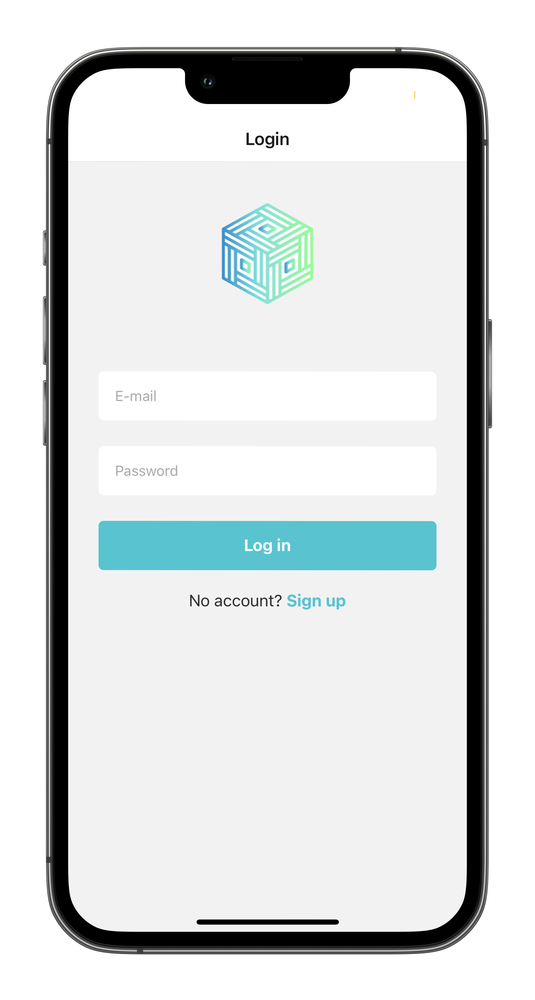</td>
			<td>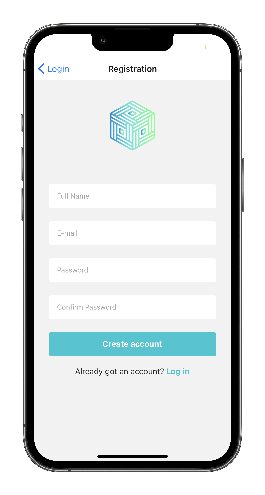</td>
		</tr>
	</table>

  <h2>Customer Account Screenshots</h2>
	<table>
		<tr>
			<td>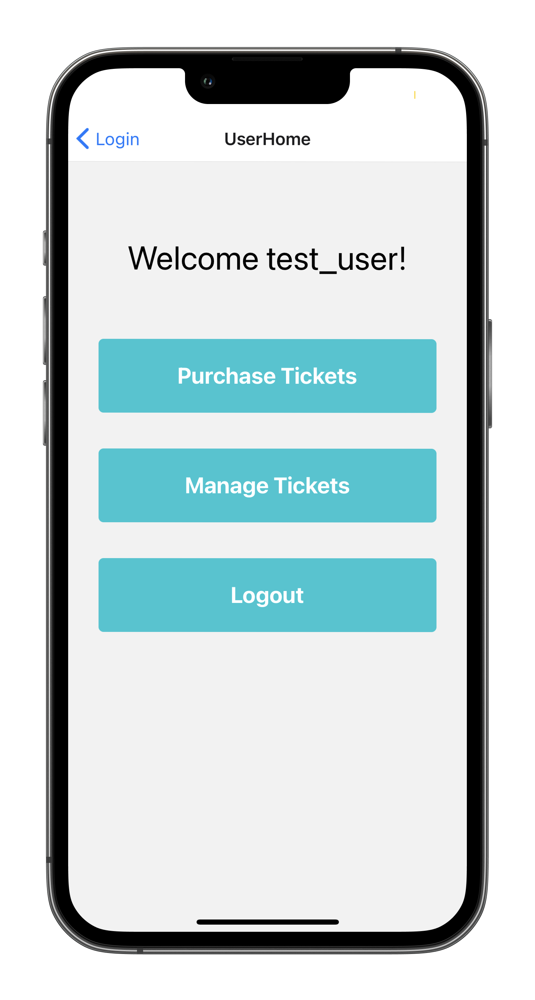</td>
			<td>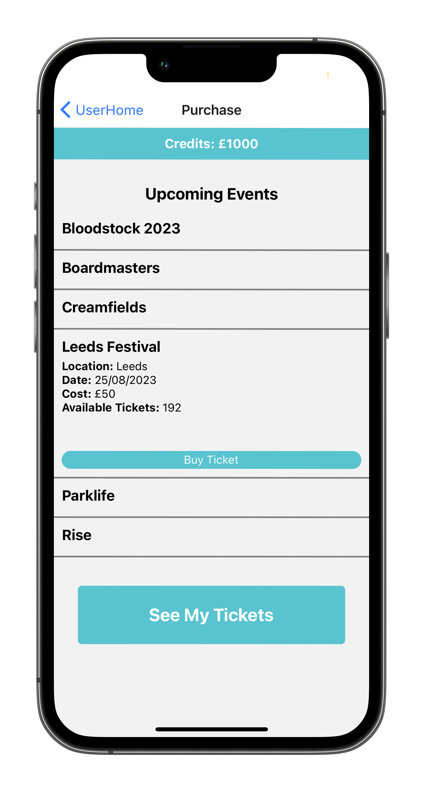</td>
		</tr>
		<tr>
			<td>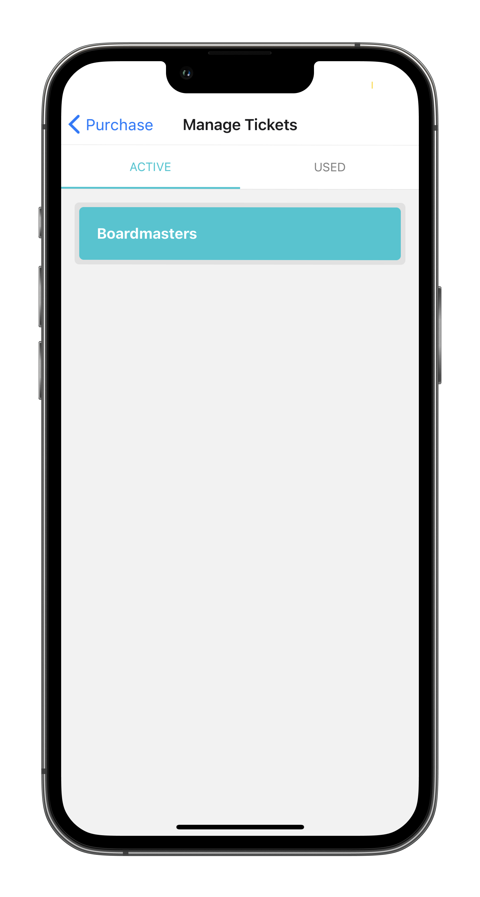</td>
			<td>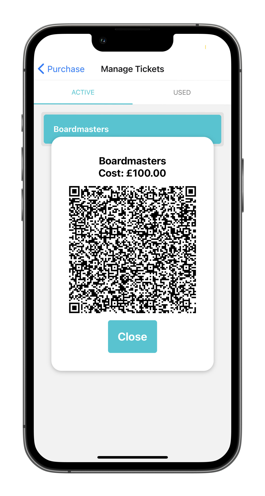</td>
		</tr>
		<tr>
			<td>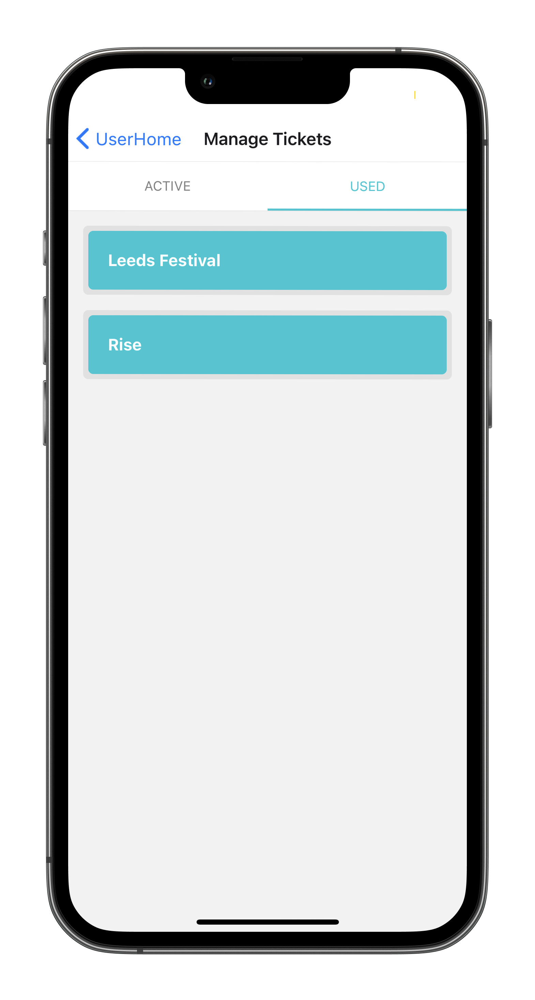</td>
			<td>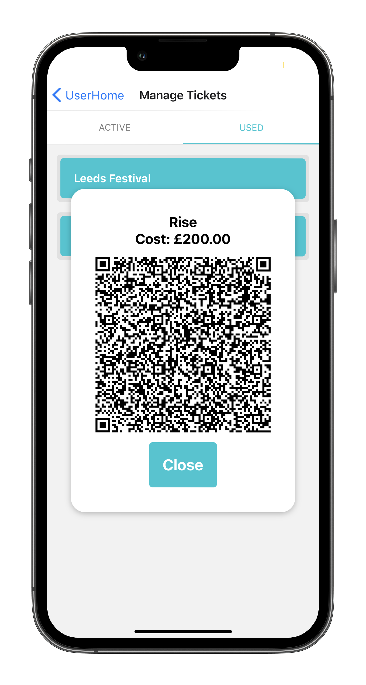</td>
		</tr>
	</table>

  <h2>Verifier Account Screenshots</h2>
	<table>
		<tr>
			<td>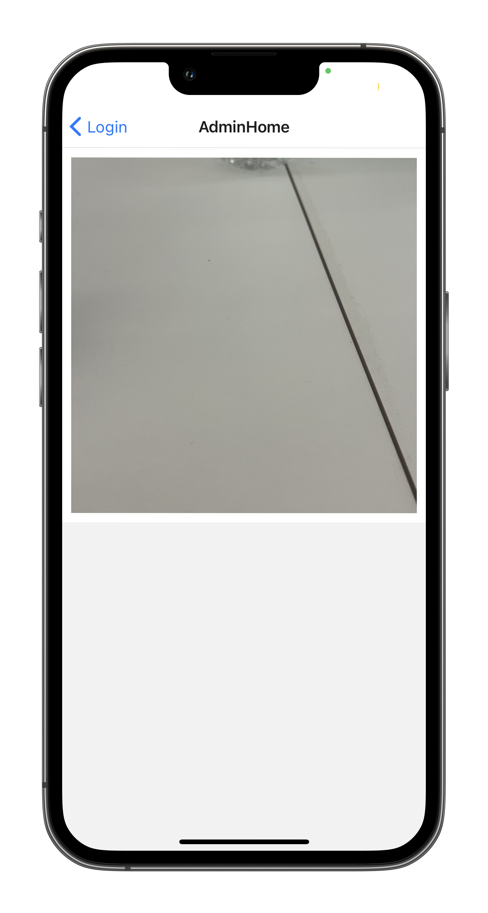</td>
			<td>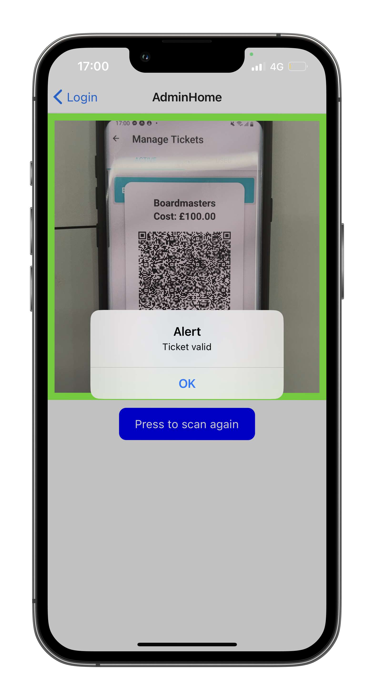</td>
		</tr>
		<tr>
			<td>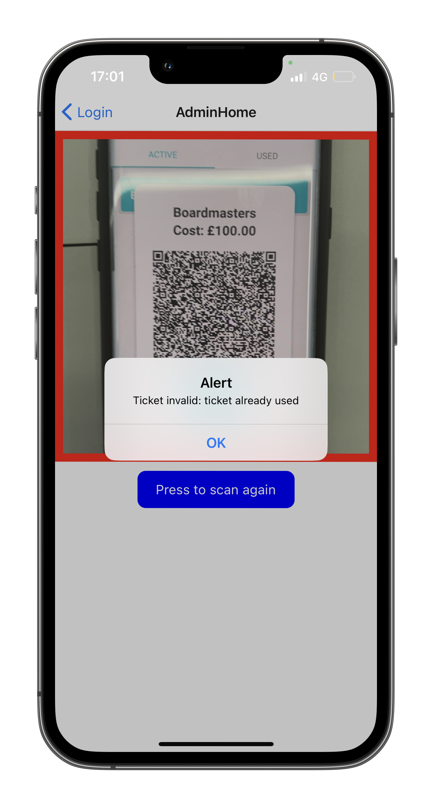</td>
      <td>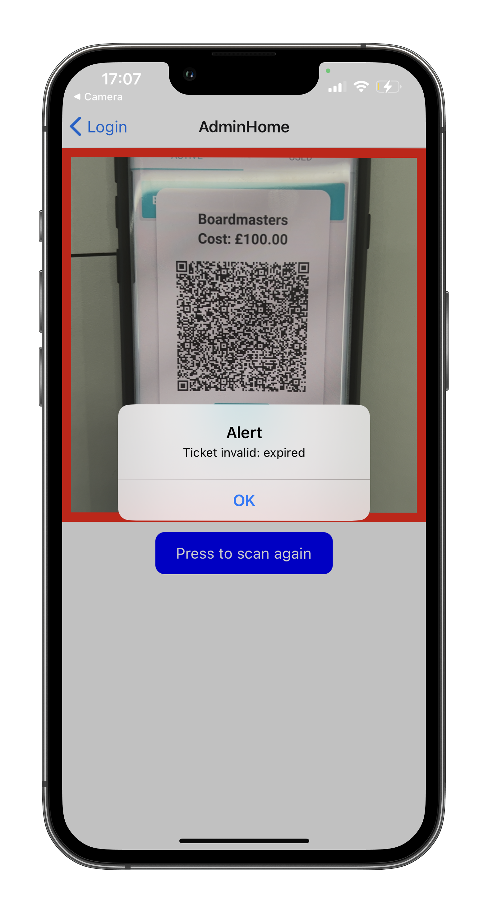</td>
		</tr>
    <tr>
			<td>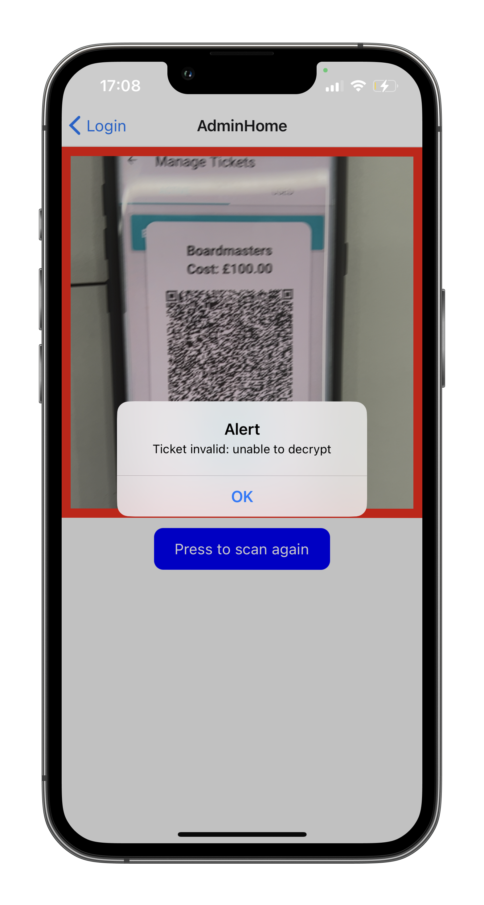</td>
		</tr>
	</table>